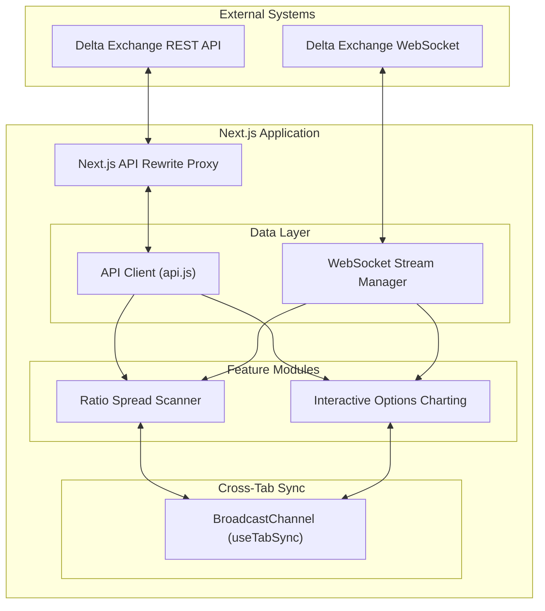

# High-Level Design (HLD)

This document provides a high-level overview of the architecture of the Ratio Spread Charts Dashboard. The application is a fully client-side Next.js React application that interfaces directly with external cryptocurrency exchange APIs to provide real-time options data.

## 1. System Architecture

The system follows a reactive, event-driven architecture heavily relying on WebSockets for real-time telemetry and REST APIs for historical backfills.

## 2. Core Modules

### 2.1 Next.js Frontend
While built on Next.js (App Router), the core functionality heavily relies on client-side rendering (`"use client"`). This is because the application requires DOM access (for charting canvases), continuous WebSocket connections, and complex local React state that cannot be pre-rendered on the server. Next.js is primarily used for routing (`/charts`, `/ratio-spread`) and local development proxying.

### 2.2 Delta Exchange Integration
- **REST API:** Used to fetch product listings (strikes, expiries), historical candle data (for chart initialization and closed-candle correction), and a one-time snapshot of the order book on startup. To bypass CORS restrictions, requests are routed through a Next.js rewrite proxy (`next.config.mjs`) to `https://api.india.delta.exchange`.
- **WebSocket Feed:** A direct wss connection establishes a live stream for `v2/ticker`, `trades`, `mark_price`, and `l2_updates`. This ensures millisecond-level accuracy for the pricing engines without polling overhead.

### 2.3 State Synchronization (BroadcastChannel)
Since a trader might have the Scanner open on one monitor and the Charts open on another, the app uses the `BroadcastChannel` API (`option-scope-sync`). When the Scanner finds top tier ratio spreads, it broadcasts them locally. The Charts module listens to this channel and automatically displays these top picks in its sidebar watchlist, creating a cohesive multi-window workspace.

## 3. Data Flow

1. **Initialization:** The application boots, fetches underlying assets, and builds a UI.
2. **Backfill:** REST APIs fetch historical data (e.g., 300 previous candles) and initial tickers to populate the screen immediately.
3. **Live Streaming:** WebSockets open. Ticks are parsed and pushed into memory buffers.
4. **Throttled Rendering:** To prevent the browser from freezing under high throughput (crypto options can tick hundreds of times per second), ticks are buffered using `useRef` and flushed to the React state via throttled/debounced timers (e.g., every 50ms for charts, every 2 seconds for scanner).
5. **UI Update:** React triggers a re-render. Charting updates the HTML5 canvas imperatively, while the scanner updates DOM tables.
