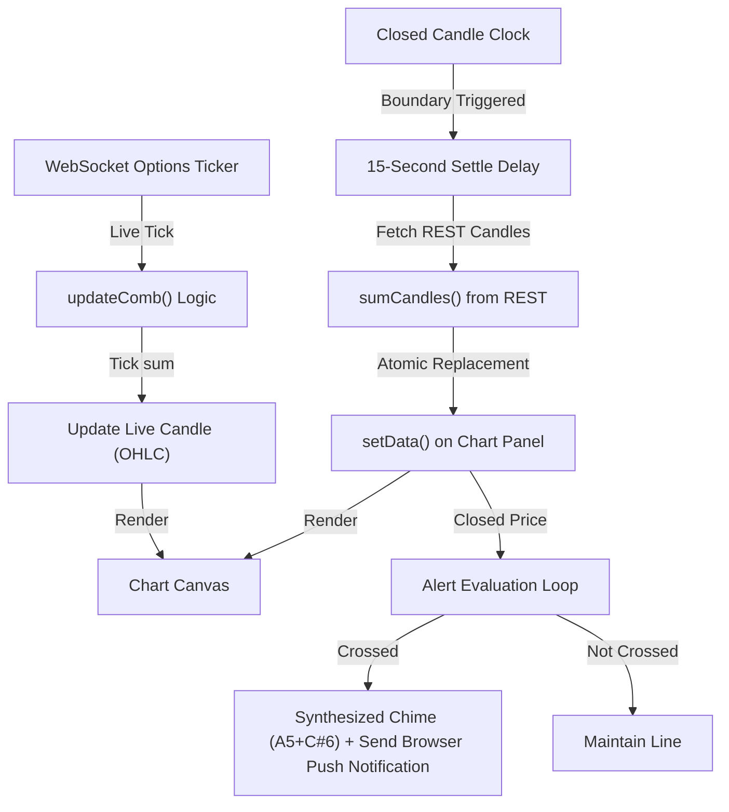

# Interactive Option Charts & Premium Monitoring — Complete Logic Explained

This document explains **every** detail of the logic, architecture, and mathematical formulas in the Option Premium Charting module in the simplest terms possible.

---

## Table of Contents

1. [The Big Picture](#the-big-picture)
2. [Component Architecture & Lifecycle](#component-architecture--lifecycle)
3. [Combined Premium Math & OHLC Construction](#combined-premium-math--ohlc-construction)
   - [The Combined High/Low Pricing Problem](#the-combined-highlow-pricing-problem)
   - [Real-Time WebSocket Tick Processing (`updateComb`)](#real-time-websocket-tick-processing-updatecomb)
   - [Wall-Clock Closed Candle Corrections](#wall-clock-closed-candle-corrections)
4. [Price Alerting Engine](#price-alerting-engine)
   - [Audio Synthesis via Web Audio API](#audio-synthesis-via-web-audio-api)
   - [Evaluation on Candle Close](#evaluation-on-candle-close)
5. [Support/Resistance Drawing Tool](#supportresistance-drawing-tool)
6. [Watchlist & Greeks Tracking](#watchlist--greeks-tracking)
7. [Technical Indicators & Overlays (SMA 20 & IV)](#technical-indicators--overlays-sma-20--iv)
8. [Data Flow Diagram](#data-flow-diagram)

---

## The Big Picture

The **Option Premium Charting Module** (`src/App.jsx`) is a high-performance options visualization workstation. It allows traders to monitor:
1. **Single Call Option** premium charts.
2. **Single Put Option** premium charts.
3. **Combined Call + Put Premium** charts (natively representing Straddles, Strangles, and spread profiles).

It tracks real-time Greeks, calculates true combined OHLC candlestick bars, overlays Simple Moving Averages (SMA) and Implied Volatility (IV) curves, manages custom price alerts with synthesized audio feedback, and provides drawing tools for Support & Resistance (S/R) lines.

---

## Component Architecture & Lifecycle

The charting workspace relies on a robust component division to separate data routing from hardware-accelerated canvas rendering:

* **App Controller** (`src/App.jsx`): Manages the state for watches, active selection, timeframes, spot pricing, and Greeks. It owns the main WebSocket connections and orchestrates initial candle fetches.
* **ChartPanel Component** (`ChartPanel` in `App.jsx`): A reusable, forwardRef-wrapped wrapper around TradingView's `lightweight-charts`. It exposes imperative controls (`setData`, `update`, `clearIvData`) to the parent.
* **Always-Mounted Design**: To prevent losing user state (zooms, scroll positions, custom support/resistance lines) when switching between Charts, Scanner, and Paper Trading, all modules are kept in the DOM simultaneously. They are toggled visible/invisible using CSS `display: none` and `display: block`.

---

## Combined Premium Math & OHLC Construction

### The Combined High/Low Pricing Problem

When charting a combined options strategy (e.g. Call + Put), we cannot construct the historical High and Low of a combined candle by simply adding the Call candle's High to the Put candle's High:

$$\text{Combined High} \neq \text{Call High} + \text{Put High}$$

Because the Call option might hit its peak price at 10:05 AM and the Put option might hit its peak at 10:14 AM, their combined price at any single instant is almost never equal to the sum of their individual highs. Summing historical highs directly from REST API candles results in an artificial, distorted price expansion.

To solve this, Crypto Scanner uses a **dual-feed synchronization mechanism**:
1. **Real-time WS Ticker ticks** evaluate the exact sum at every incoming tick, maintaining a mathematically precise combined candle.
2. **Closed Candle Correction Scheduler** replaces the closed candles with official REST data after a settle delay.

---

### Real-Time WebSocket Tick Processing (`updateComb`)

As trades and quotes tick over the WebSocket connection, the `updateComb` function aggregates the prices on a tick-by-tick basis:

1. **Time Synchronization**: At candle boundaries, Call and Put ticks may arrive slightly out of sync. The system uses the **older** timestamp of the two legs to prevent the combined chart from spiking:
   $$\text{Anchor Time} = \min(\text{Call Time}, \text{Put Time})$$
2. **Lag Protection**: If one leg has rolled over to the next candle time bucket while the other is lagging, the system uses the `open` price of the rolled-over leg (which is approximately equal to its previous close) for the lagging time interval to prevent artificial gaps.
3. **OHLC Construction**:
   - If a new candle bucket starts ($\text{Time} > \text{Last Candle Time}$), the combined price initializes a new OHLC candle:
     $$\text{Open} = \text{High} = \text{Low} = \text{Close} = \text{Call Close} + \text{Put Close}$$
   - If ticking inside the active candle bucket, the High and Low are expanded dynamically:
     $$\text{Close} = \text{Call Close} + \text{Put Close}$$
     $$\text{High} = \max(\text{High}, \text{Close})$$
     $$\text{Low} = \min(\text{Low}, \text{Close})$$

---

### Wall-Clock Closed Candle Corrections

Because WebSocket feeds can experience packet drop or local network latency, closed candles must be periodically corrected against Delta Exchange's official historical REST API.

1. **Boundary Scheduler (`scheduleCandleCorrections`)**: When the engine is monitoring, it calculates the milliseconds remaining until the active candle bucket closes:
   $$\text{msUntilClose} = (\text{Next Candle Boundary} - \text{Current Unix Time}) \times 1000$$
2. **Settle Cooldown (15 seconds)**: The scheduler waits for the candle to close, plus an additional **15 seconds** (`SETTLE_MS`) to allow Delta Exchange's REST servers to finalize and write the candle data.
3. **REST Fetch & Atomic Swap**: The scheduler fetches the closed candles for both legs from REST, merges them using `sumCandles`, and performs a `setData(finalData, false)` atomic replacement. This corrects any WebSocket dropouts in the past while preserving the scroll position and the current live candle.

---

## Price Alerting Engine

Crypto Scanner features a price alerting engine that allows users to place horizontal trigger boundaries on any active chart.

### Audio Synthesis via Web Audio API

To avoid relying on heavy static `.mp3` assets, the alert engine synthesizes audio alerts natively using the browser's **Web Audio API**:

- **Oscillators & Gain**: It instantiates an `AudioContext` and creates an `OscillatorNode` paired with a `GainNode` to play notes.
- **Synthesized Chord**: Plays a pleasant, two-note synthesized electronic chime:
  1. An **A5** note ($880\text{ Hz}$) for $0.2\text{ seconds}$.
  2. A **C#6** note ($1108.73\text{ Hz}$) starting $0.15\text{ seconds}$ later, decaying exponentially for $0.4\text{ seconds}$.

```javascript
const playNote = (freq, startTime, duration) => {
  const osc = ctx.createOscillator();
  const gain = ctx.createGain();
  osc.connect(gain);
  gain.connect(ctx.destination);
  osc.type = 'sine';
  osc.frequency.setValueAtTime(freq, startTime);
  gain.gain.setValueAtTime(0.1, startTime);
  gain.gain.exponentialRampToValueAtTime(0.001, startTime + duration);
  osc.start(startTime);
  osc.stop(startTime + duration);
};
```

---

### Evaluation on Candle Close

To prevent false alarms caused by temporary volatility spikes, alerts are evaluated **only on officially closed candles** during the correction cycle (`refreshAllHistory`):

- **Trigger Check**:
  - **`>=` (Above/Equals)**: Triggers if $\text{Closed Candle Close} \ge \text{Alert Price}$
  - **`<=` (Below/Equals)**: Triggers if $\text{Closed Candle Close} \le \text{Alert Price}$
- **Action**: When triggered, it plays the audio synthesizer, broadcasts a local UI toast notification, triggers a native browser Push Notification (if permissions are granted), and deletes the alert row to prevent duplicate alarms.

---

## Support/Resistance Drawing Tool

Traders can draw custom horizontal Support & Resistance (S/R) lines directly onto the chart canvas:

1. **Crosshair Mode**: Clicking the **S/R Pencil Icon** enables draw mode and changes the container cursor to `crosshair`.
2. **Coordinate Translation**: When the user clicks the chart container, the event handler retrieves the y-coordinate of the mouse click and translates it to the corresponding options price:
   $$\text{Price} = \text{SeriesRef.coordinateToPrice}(y)$$
3. **Price Line Generation**: An overlay line is generated on the series using `createPriceLine()`, styled in gold/yellow (`#e3b341`), and labeled "S/R".
4. **Auto-off Switch**: After drawing a single line, draw mode is automatically disabled and the cursor is returned to default to prevent accidental drawings.

---

## Watchlist & Greeks Tracking

The chart panel is supported by a real-time sidebar displaying option greeks and watchlist selections:

* **Unified Greeks Display**: Under the chart, a greeks table displays the live Greeks extracted from the `v2/ticker` stream:
  - **Delta ($\Delta$)**, **Gamma ($\Gamma$)**, **Vega ($\mathcal{V}$)**, **Theta ($\Theta$)**, and **Rho ($\rho$)**.
  - Directional Implied Volatility (IV) for Call (Ask IV) and Put (Bid IV) legs.
* **Watchlist Manager**: The watchlist card stores selected contract pairs in React state. Users can quickly switch the chart focus by clicking any watchlist entry, which automatically tears down the active WebSocket connection, resets chart buffers, and builds a new ticker stream.

---

## Technical Indicators & Overlays (SMA 20 & IV)

The `ChartPanel` supports overlays that render concurrent data feeds:

* **SMA 20 (Simple Moving Average)**: Calculates the average close price of the last 20 candles. Computed dynamically on initialization (`setData`) and updated in real-time on each closed candle.
* **Implied Volatility Overlay**: When enabled via checkboxes (`showIvCall`/`showIvPut`), a secondary line series is added to the chart, displaying Call and Put Implied Volatility curves on the same timeline.

---

## Data Flow Diagram

The following diagram illustrates how WebSocket ticks and REST API data combine to maintain a clean, corrected options premium chart:

