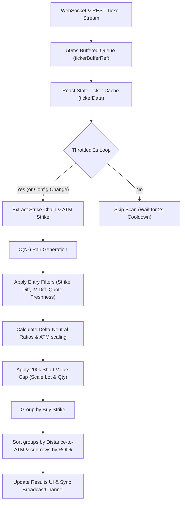

# Ratio Spread Scanner — Complete Logic Explained

This document explains **every** logic, condition, and mathematical formula in the Ratio Spread Scanner module in the simplest terms possible.

---

## Table of Contents

1. [The Big Picture](#the-big-picture)
2. [Scanner Lifecycle (Boot Sequence)](#scanner-lifecycle)
3. [The Scan Loop (2-Second Throttled Evaluation)](#the-scan-loop)
4. [Spread Pair Validation (Entry Filters)](#spread-pair-validation)
5. [Key Calculations & Formulas](#key-calculations--formulas)
   - [Delta-Neutral Ratio Calculation](#delta-neutral-ratio-calculation)
   - [ATM Ratio Scaling](#atm-ratio-scaling)
   - [$200K Short Value Portfolio Cap](#200k-short-value-portfolio-cap)
   - [At ATM P&L & Margin (ROI %)](#at-atm-pl--margin-roi-)
6. [Quote Freshness & REST Backfill](#quote-freshness--rest-backfill)
7. [Grouped Strikes & ROI Sorting](#grouped-strikes--roi-sorting)
8. [Data Flow Diagram](#data-flow-diagram)

---

## The Big Picture

The **Ratio Spread Scanner** is a real-time discovery engine for option ratio spreads.
A ratio spread consists of **buying 1 option** (the long/buy leg) and **selling multiple options** at a further out-of-the-money strike (the short/sell leg). 

The scanner's job is to:
1. Fetch all live option contracts (calls and puts) for a selected underlying and expiry date.
2. Form all possible pairs of options.
3. Apply filters (strike difference, IV difference, premium ratio, etc.) to weed out bad spreads.
4. Scale quantities based on user limits and portfolio risk parameters.
5. Project what the spread's value would be if the spot price moved exactly to the long leg's strike (the At-The-Money boundary).
6. Rank and display these opportunities in a responsive tabular format, updating in real time.

---

## Scanner Lifecycle

When you select an underlying (BTC/ETH) and expiry date, and click **▶ START SCAN**, the scanner executes the following boot sequence:

```
[Start Scan Clicked]
        │
        ▼
[Reset Local State] ───► Clear results, reset ticker cache, reset last refreshed time
        │
        ▼
[Strike Extraction] ───► Find all available strike prices for selected expiry
        │
        ▼
[REST Backfill] ────► Query Delta REST API /v2/tickers to pre-populate quotes
        │             * Set bid/ask timestamps to Date.now() for immediate freshness
        ▼
[WS Subscription] ──► Open WebSocket connection to Delta Exchange and subscribe to:
        │             * Live ticker v2/ticker stream for all option symbols
        │             * Underlying Spot price perpetual future ticker
        ▼
[Scan Loop Active] ──► Run computeSpreads() immediately, then enter 2-second throttled loop
```

### Configuration Storage & Independence

Unlike Paper Trading parameters which are synchronized with Supabase databases, the Ratio Spread Scanner configuration operates as a **completely standalone client-side component**:
* **Storage Location**: The settings (such as filter thresholds and scaling options) are saved directly in the user's browser `localStorage` under the key `vitti_algo_config`.
* **Zero Database Overhead**: This prevents network roundtrips to database servers and avoids permission boundaries, making configuration updates instantaneous and persistent across browser sessions for the local device.

---

## The Scan Loop

To keep the UI highly responsive without freezing the browser thread under heavy WebSocket bursts:
* **Buffered WebSocket Telemetry**: Incoming ticks are batched into a temporary buffer and flushed to React state at most once every **50 milliseconds**. To prevent data leakage from old subscriptions (e.g., when rapidly switching between BTC and ETH), every tick is verified against an active **Scan Session ID** before buffering.
* **Throttled Spread Computation**: The actual scanning logic (`computeSpreads`) is rate-limited to run at most once every **2 seconds** during live streaming.
* **Instant Config Updates**: Whenever the user edits configuration thresholds (e.g., changes *Min Strike Diff* or *Max Ratio*), the 2-second throttle is bypassed, refreshing results instantly.

---

## Spread Pair Validation

Every candidate pair of options must pass **all** of these filters to be displayed:

| # | Filter | Config Key | Call Criteria | Put Criteria |
|---|--------|-----------|---------------|--------------|
| 1 | **Directional Filter** | — | Long strike $\ge$ ATM strike | Long strike $\le$ ATM strike |
| 2 | **Strike Difference** | `minStrikeDiff` | Sell strike - Buy strike $\ge$ Min | Buy strike - Sell strike $\ge$ Min |
| 3 | **Leg Expiry Match** | — | Expiry must be identical for both legs | Expiry must be identical for both legs |
| 4 | **Positive Bid/Ask** | — | Buy leg must have Ask > 0, Sell leg must have Bid > 0 | Buy leg must have Ask > 0, Sell leg must have Bid > 0 |
| 5 | **Quote Freshness** | — | Both bid and ask must be updated within the last 120s | Both bid and ask must be updated within the last 120s |
| 6 | **IV Difference** | `minIvDiff` | $\lvert \text{Buy Ask IV} - \text{Sell Bid IV} \rvert \ge \text{Min IV Diff}$ | $\lvert \text{Buy Ask IV} - \text{Sell Bid IV} \rvert \ge \text{Min IV Diff}$ |
| 7 | **Min Long Distance** | `minLongDist` | Buy strike - Spot price $\ge$ Min | Spot price - Buy strike $\ge$ Min |
| 8 | **Min Sell Premium** | `minSellPremium` | Sell leg best Bid price $\ge$ Min | Sell leg best Bid price $\ge$ Min |
| 9 | **Ratio Deviation** | `maxRatioDeviation` | Deviation between premium ratio and delta-notional ratio $\le$ Max Deviation | Deviation between premium ratio and delta-notional ratio $\le$ Max Deviation |
| 10| **Max Sell Ratio** | `maxSellQty` | Scaled sell quantity $\le$ Max Ratio | Scaled sell quantity $\le$ Max Ratio |
| 11| **Max Debit** | `maxNetPremium` | Net debit (if debit spread) $\le$ Max Debit (Max net premium $\ge -\text{netPremium}$) | Net debit (if debit spread) $\le$ Max Debit (Max net premium $\ge -\text{netPremium}$) |

---

## Key Calculations & Formulas

### Delta-Neutral Ratio Calculation

To structure the spread so it is delta-neutral at entry, the scanner calculates the ratio of the long leg's delta notional relative to the short leg's delta notional:

$$\text{Delta Notional} = |\text{Option Delta}| \times \text{Contract Size}$$

$$\text{Raw Ratio} = \frac{\text{Buy Leg Delta Notional}}{\text{Sell Leg Delta Notional}}$$

The raw ratio is then rounded to the nearest **0.25** fraction (minimum 1.00) to find the base short quantity:

$$\text{sellQty} = \max\left(1.0, \text{round}\left(\frac{\text{Raw Ratio}}{0.25}\right) \times 0.25\right)$$

### ATM Ratio Scaling (Visual Simulation Mode)

When the **ATM Ratio Entry** checkbox (`atmRatioScaling`) is enabled in the configuration bar, the scanner activates an automated visual simulation mode:
* **Dynamic Scaling**: The sell quantity (ratio) is scaled up proportionally if the current spread ratio is lower than what is available at ATM strikes:

  $$\text{atmRatio} = \frac{\text{ATM Buy Price}}{\text{ATM Sell Price}}$$

  $$\text{ratioDiff} = \max(0, \text{atmRatio} - \text{sellQty})$$

  $$\text{Adjusted Sell Qty} = \text{sellQty} + \left(\frac{\text{ATM Pct}}{100} \times \text{ratioDiff}\right)$$

  This is then rounded to the nearest 0.25. The percentage adjustment is set via `atmRatioPctCall` and `atmRatioPctPut` config variables.
* **Golden Highlighting**: If the scaled ratio deviates from the natural ratio, the ratio indicator in the table dynamically shifts and is highlighted in **golden text** (`var(--accent)`, `#f0b90b`) to visually emphasize that ATM ratio scaling is active for that candidate.
* **Portfolio Cap Interactivity**: The adjusted ratio continues to interact with the **$200K Short Value Portfolio Cap**, meaning if the scaled short value exceeds $200,000, both the buy leg lot size and final sell quantity are scaled down proportionally.
* **Legacy "Base/Extra" Toggle Deprecation**: The legacy, manual dollar-based "Base/Extra" toggle has been completely removed from both the scanner layout and computation logic. The automated ATM Ratio Scaling provides a much cleaner, streamlined approach to simulating ratio shifts.

### $200K Short Value Portfolio Cap

To restrict exposure, the system enforces a strict portfolio notional cap on the short side. At 200× leverage, a maximum notional short value of **$200,000** is allowed per position.

$$\text{Short Value} = \text{Spot Price} \times \text{Adjusted Sell Qty} \times \text{Sell Leg Lot Size}$$

If $\text{Short Value} \ge \$200,000$, the scanner scales down both the buy leg lot size and sell leg quantity proportionally:

$$\text{Scale Factor} = \frac{200,000}{\text{Short Value}}$$

$$\text{Adjusted Lot Size} = \text{Buy Leg Lot Size} \times \text{Scale Factor}$$

$$\text{Final Sell Qty} = \text{Adjusted Sell Qty} \times \text{Scale Factor}$$

### At ATM P&L & Margin (ROI %)

To evaluate the profitability of a ratio spread, the scanner simulates what happens if the spot price moves to the buy strike (ATM boundary):
* The buy leg becomes At-The-Money (ATM).
* The sell leg becomes Out-Of-The-Money (OTM) by `strikeDiff`.

$$\text{buyIntrinsic} = \text{ATM Buy leg Bid price}$$

$$\text{sellIntrinsic} = \text{OTM Sell leg Ask price (at ATM} \pm \text{strikeDiff)}$$

$$\text{ATM PnL} = [(\text{buyIntrinsic} - \text{Entry Buy Price}) + (\text{Entry Sell Price} - \text{sellIntrinsic}) \times \text{originalSellQty}] \times \text{Adjusted Lot Size}$$

$$\text{Margin Requirement} = (\text{Entry Buy Price} \times \text{Adjusted Lot Size}) + \frac{\$200,000}{\text{Leverage (200)}}$$

$$\text{ROI} = \left(\frac{\text{ATM PnL}}{\text{Margin Requirement}}\right) \times 100$$

> [!NOTE]
> When `atmRatioScaling` is enabled, the displayed Net Premium in the scanner table dynamically updates to reflect the scaled short quantity: `(Entry Sell Price * scaledQty) - Entry Buy Price`.

#### Nearest-Strike ATM Fallback Logic

To prevent empty cells (`—` or `$0.00`) when option chains are sparse (often the case on high-volatility or newly created expiries), the system implements a **nearest-strike fallback** during ATM intrinsic price checks:
* **Lookup Sequence**: The scanner first searches for an exact match of the target strike. If the exact strike ticker does not exist, it identifies the closest available strike of the same option type (Call or Put) under the same expiry.
* **Tight Point Tolerances**:
  * **BTC**: Searches within a maximum tolerance of **$\pm 500$ points** from the target strike.
  * **ETH**: Searches within a maximum tolerance of **$\pm 50$ points** from the target strike.
* **Omission**: If no strike falls within these absolute point boundaries, the fallback returns `null`, and the corresponding spread's ATM P&L, Margin, and ROI% calculations are omitted (rendered as `—` in the UI).

---

## Quote Freshness & REST Backfill

To avoid listing spreads with stale, non-existent, or model-derived prices on illiquid option strikes, the scanner utilizes a **120-second quote freshness guard**. Both option legs must have best bid/ask quotes updated by the data feed within the last 120 seconds.

* **Immediate Load via REST Backfill**: On startup, the scanner fetches the latest product tickers via REST. To prevent the table from remaining empty until WebSocket ticks occur, the scanner checks if a valid bid/ask quote exists in the REST data and initializes `bidUpdatedAt` and `askUpdatedAt` to `Date.now()`.
* **WebSocket Overwrites**: As WebSocket frames flow in, these timestamps are continuously updated with live tick times. If a strike doesn't tick on WebSocket and is not refreshed by REST for over 120 seconds, it goes stale and is temporarily filtered out of the active opportunities table to prevent bad entries.

---

## Grouped Strikes & ROI Sorting

To make the dashboard clean and legible:
1. **Strike Grouping**: Spread opportunities sharing the same **Buy Strike** are grouped together in a single parent table row.
2. **Expansion**: If multiple sell strikes are valid for a single buy strike, the row displays the highest ROI candidate as the parent row and features a toggle arrow. Clicking it expands a dropdown showing the alternative sell strike candidates.
3. **Sorting Order**:
   * **Group Sorting**: Unique buy strike rows are sorted by their distance to ATM (closest first). Calls are sorted ascending from ATM strike, while Puts are sorted descending from ATM strike.
   * **Sub-Row Sorting**: Alternative candidate rows within a buy strike group are sorted descending by their projected **ROI % at ATM**.

---

## Data Flow Diagram

